# vnxianxia — Azure Cloud Sect: *The Lotus and the Blood Moon*

A third-person **xianxia action-RPG** with a **2000-quest main story**, built entirely from code.
Headless **Blender 5.2.2** Python scripts model, texture, rig and animate every character, creature and
building. Five generated maps, a voiced story with cinematics, and a full game runtime (quests, dialogue,
combat, HUD, loading screens, journal) run in **Godot 4.7.2**. The music and sound effects are synthesised
with numpy, and all 974 voice lines are neural TTS (Piper).

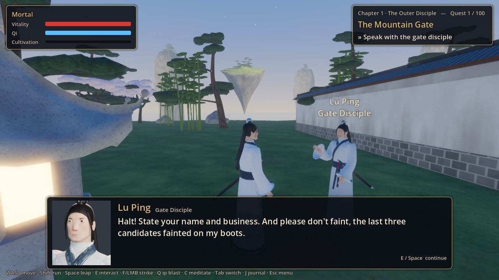

| Chapter intro cinematic | Quest HUD: tracker, compass, objective marker |
|---|---|
| 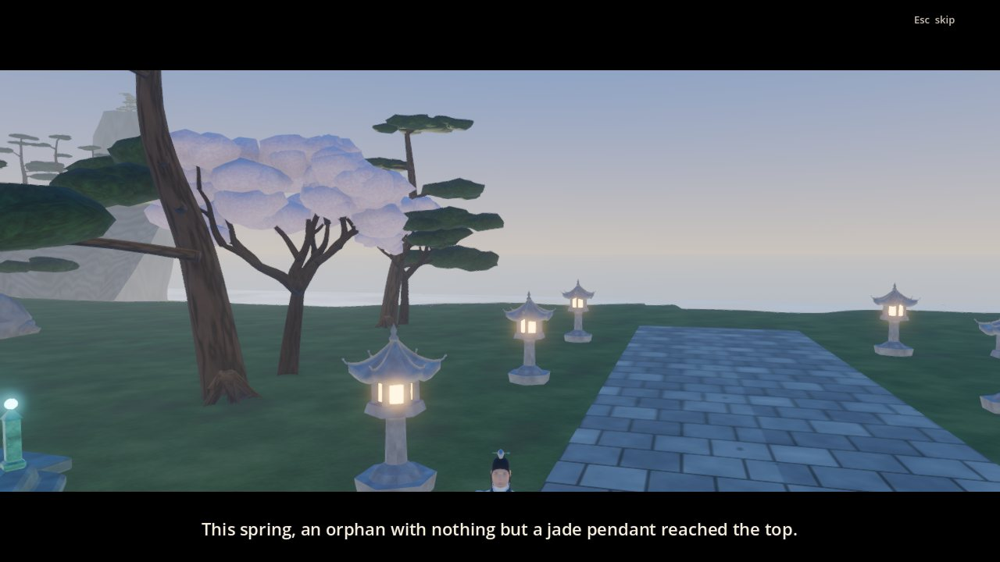 | 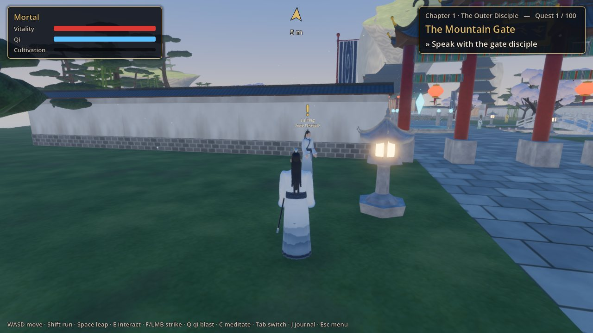 |
| **Spirit wolves in the bamboo forest** | **Boss: Jiao, the Flood Dragon** |
| 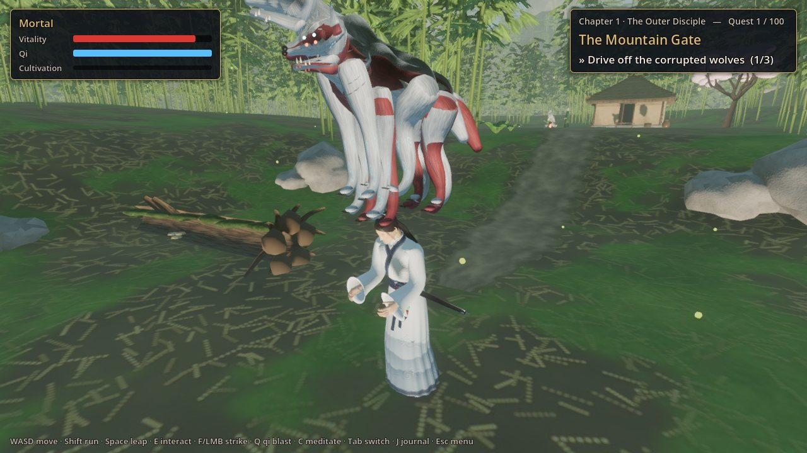 | 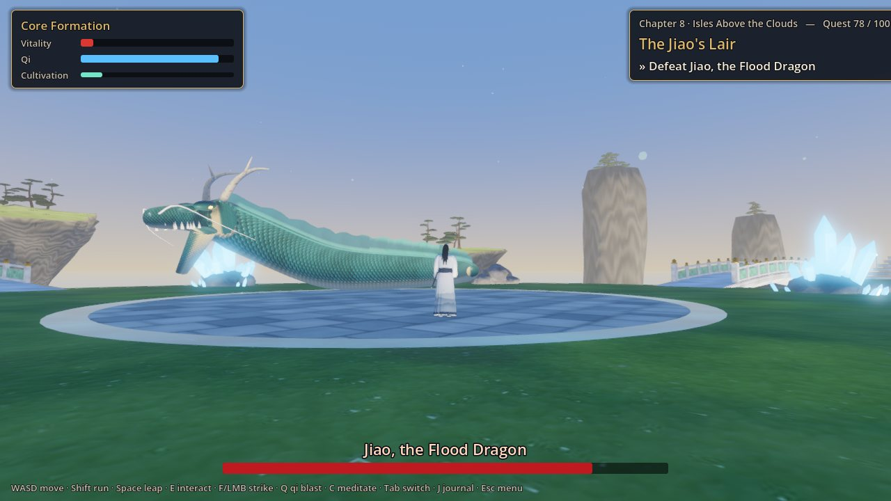 |
| **Title screen** | **Loading screen with the chapter synopsis** |
| 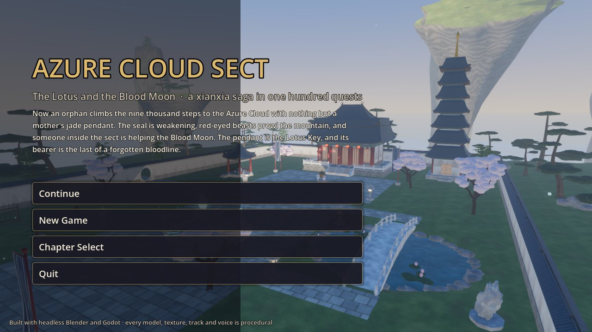 | 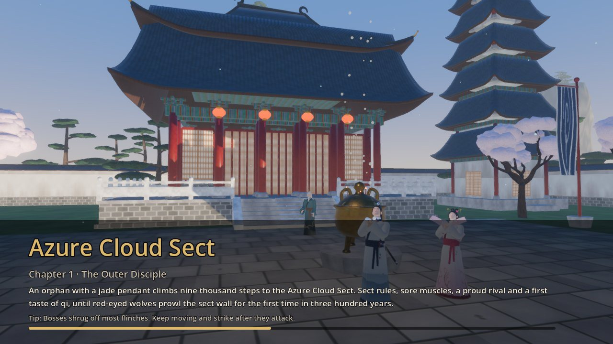 |

## The story

*Three hundred years ago the Blood Moon Patriarch drowned three kingdoms in blood trying to seize the heavens.
The Azure Cloud and Verdant Lotus sects sealed him beneath the Abyss, and the world forgot the Verdant Lotus.
Now an orphan climbs nine thousand steps to the Azure Cloud with nothing but a mother's jade pendant. The seal is
weakening, and someone inside the sect is helping the Blood Moon.*

The saga has 2000 main quests: 10 volumes, one per major stage of cultivation from Qi Condensation to Tribulation
Transcendence, each of 10 chapters of 20 quests, one chapter per minor stage (1st Layer to Great Perfection), from
Mortal to Immortal Ascension. Every major breakthrough calls down a heavenly tribulation to survive, and all but one
quest (the finale's climactic tribulation fight, which has no room for one) offers a moral choice that moves the hero
along two axes, Bearing (disciplined/precept-bound &lt;-&gt; free-wandering) and the Dao (righteous &lt;-&gt; demonic),
giving nine cultivation temperaments from Guardian of the Precepts to Servant of the Blood Moon; elders, juniors,
townsfolk and demonic cultivators react to the alignment and realm the hero reaches. It has 20 cinematics, 40 named
NPCs and 12,769 words of voiced dialogue (813 lines, plus male and female takes of every line that names the hero) in
the ten original chapters, and 118,000 more words of text-only dialogue in the 90 chapters built around them. Play as
**Lin Feng** or **Su Yue**; Tab switches between
them and the dialogue follows. The full plot, the cast and the volume and chapter lists are in
**[docs/STORY.md](docs/STORY.md)**; every quest is listed in **[docs/QUESTS.md](docs/QUESTS.md)**. In game, the
journal's *Story So Far* page recaps every volume and chapter you have reached.


```mermaid
flowchart LR
    V1["I · Qi Condensation<br/>The Mountain and the Pendant<br/>sect · bandits · first secret realm"] --> V2["II · Foundation Establishment<br/>The Traitor in the Law Hall<br/>ruins · tournament · beast tide"]
    V2 --> V3["III · Core Formation<br/>Blood Beneath the Earth<br/>Abyss · siege · Nine Banners"]
    V3 --> V4["IV · Nascent Soul<br/>Isles Above the Clouds<br/>Sky Isles · soul techniques"]
    V4 --> V5["V · Soul Transformation<br/>The Heart Demon<br/>Elder Mo's sacrifice · the fold"]
    V5 --> V6["VI · Spirit Severing<br/>The Fold in the World<br/>rifts · Rungs of the Ladder"]
    V6 --> V7["VII · Void Refinement<br/>A Body Worth Stealing<br/>Brother Hollow · the Butcher"]
    V7 --> V8["VIII · Body Integration<br/>The Great Vehicle<br/>conclave of forty sects · Lady Silk"]
    V8 --> V9["IX · Mahayana<br/>Heaven Takes Notice<br/>lesser tribulation · the Seventh Rung"]
    V9 --> V10["X · Tribulation Transcendence<br/>The Last Blood Moon<br/>Patriarch · the Stair · Immortal Ascension"]
```

## Characters

Every model is sculpted procedurally: a cross-section skull with cheekbones, a mandible angle and a squared chin
(no more egg-shaped heads); a lofted ear with helix, antihelix and concha; and hands built as one
Catmull-Clark-subdivided surface with knuckles, finger pads and nails, driven by 15 finger bones per hand
(54-bone rig). Skin textures have multi-scale pores, skin lines, haemoglobin and venous tint, a beard shadow,
T-zone roughness and individual brow hairs. Godot renders them with subsurface scattering.

| Face (Cycles) | Profile | Hand |
|---|---|---|
| 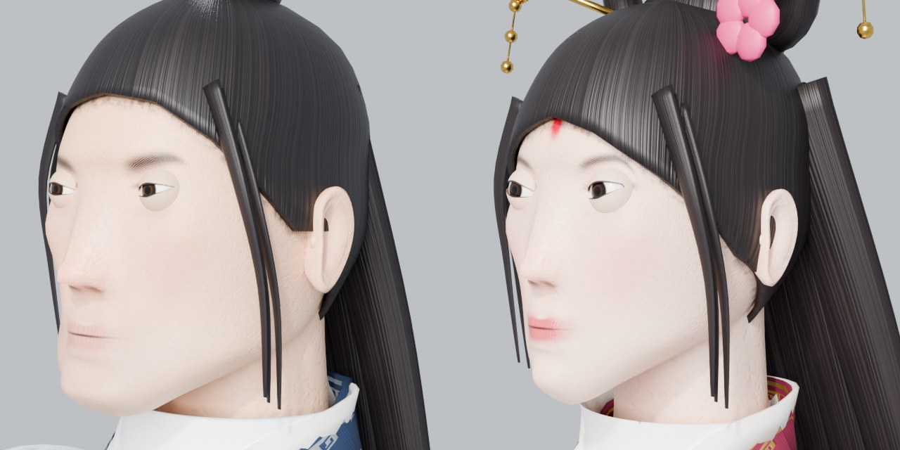 | 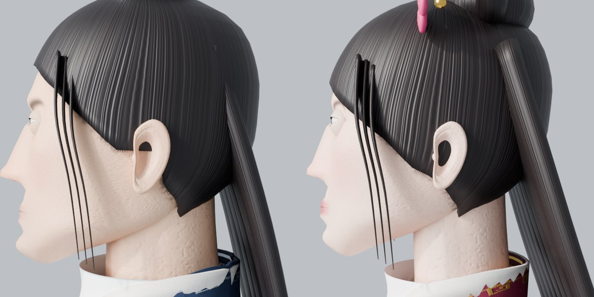 | 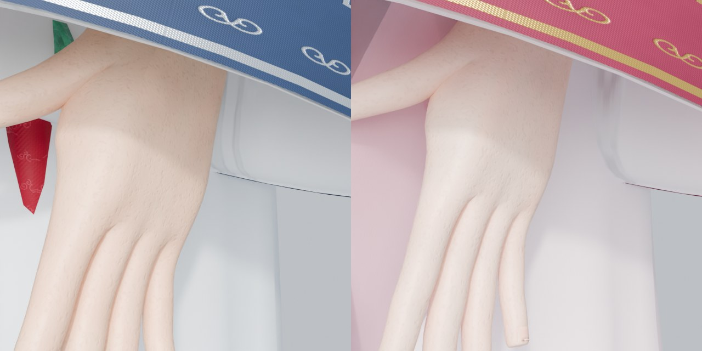 |

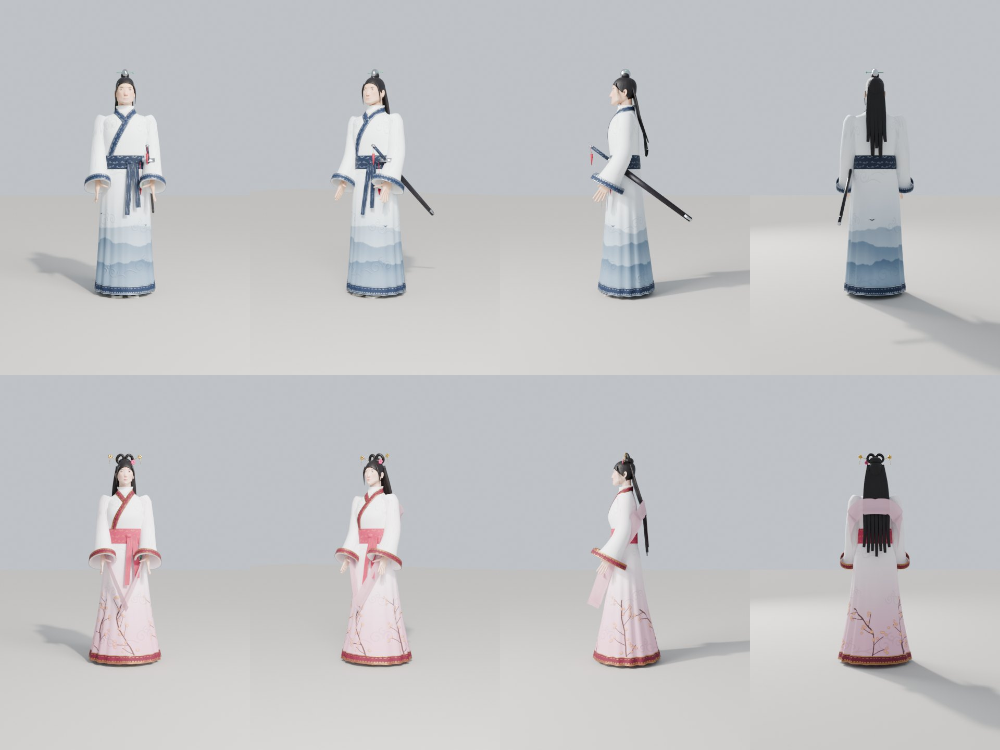

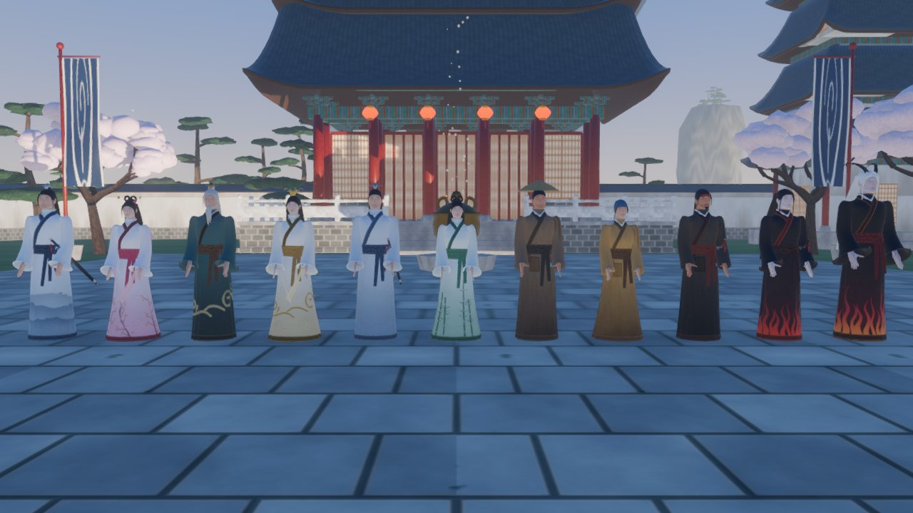

| Model | Used for |
|---|---|
| `cultivator_male` / `cultivator_female` | the heroes Lin Feng and Su Yue (the heart demon is a shadow clone) |
| `elder_male`, `sect_master`, `disciple_male/female`, `villager_male/female` | 26 NPCs, re-tinted per character |
| `bandit`, `demon_cultivator`, `blood_patriarch` | enemies and the final boss (glowing irises, horns) |
| `stone_golem` | training puppets, stone sentinels, the Lotus Guardian (humanoid rig of rock chunks) |
| `spirit_wolf` | spirit, corrupted and king wolves (quadruped rig) |
| `jiao_serpent` | the flood dragon boss (spine-chain rig) |

Humanoids have 10 animations: `idle walk run salute cast attack hit death meditate talk`. Creatures have
`idle walk run attack hit death`. Finger poses (fist, sword seal, mudra, open palm) are animated too.

The two heroes carry **136 animations** (the 10 above plus 126 from `blender/xianxia/moves.py`): locomotion
extras (walk back, strafes, run start/stop, turns, qinggong sprint, crouch, sneak, jump start/air/fall/land,
hard landing, somersault, glide, slide, ledge hang, climb), palm / kick / jian-sword combos, spin and flying
kicks, a charged strike, four qi techniques, block / parry / dodges / roll / backflip, directional staggers,
knockdown and get-up, two deaths and a revival, meditation variants, breakthrough, hand seals, flying-sword
riding, 50+ social and daily-life emotes, a four-part dance, victory poses, idle fidgets and talk gestures.
Each is authored as a few key poses of readable controls (IK hand and foot targets, torso angles, finger
presets) and solved per frame with two-bone IK so planted feet stay planted, with monotone spline easing,
overlapping-action offsets and seamless loops; the GLBs are then keyframe-reduced (about 6.7 MB each).

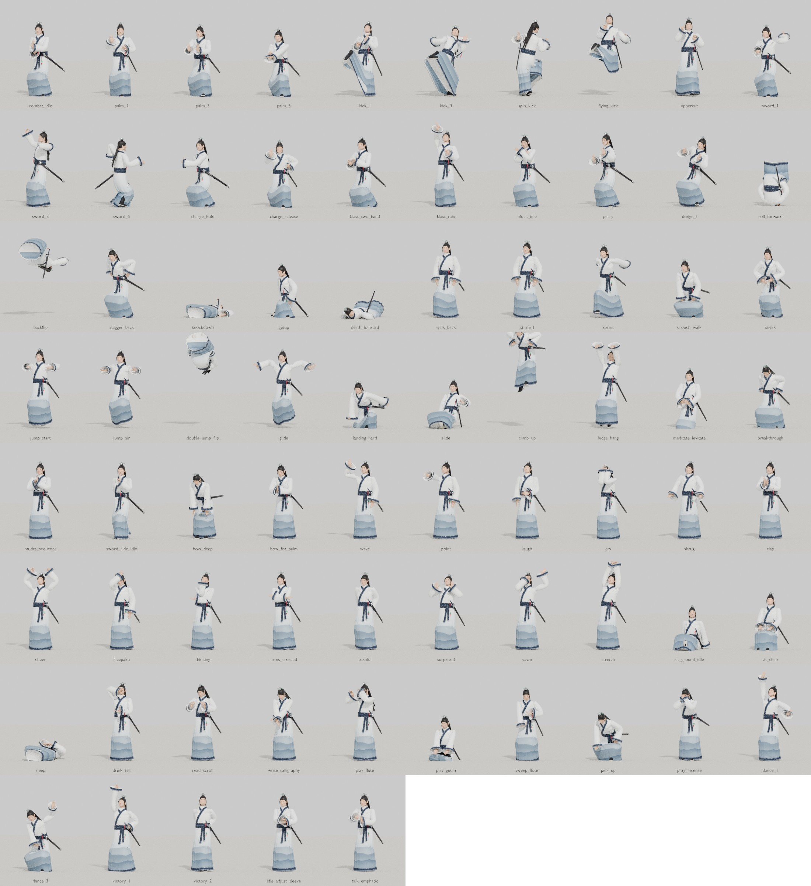

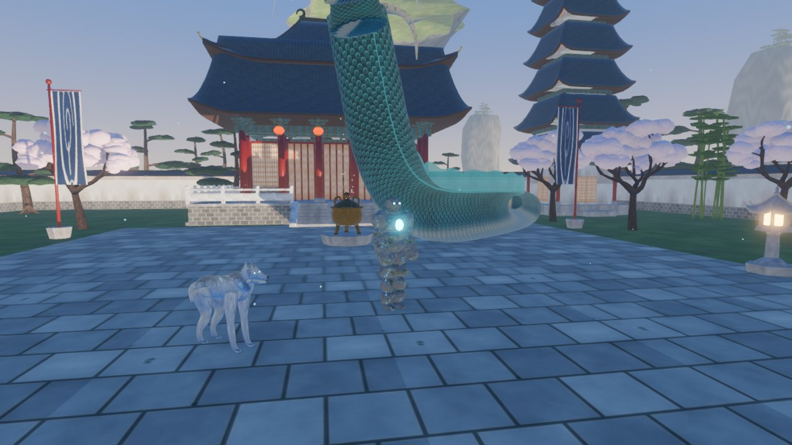

## Maps

| Azure Cloud Sect | Whispering Bamboo Forest | Qingshi Town |
|---|---|---|
| 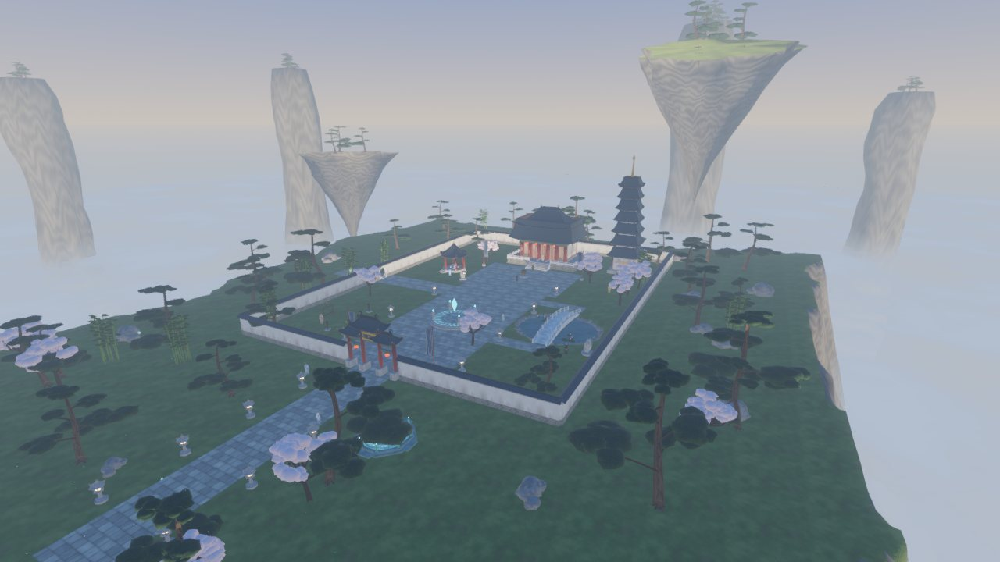 | 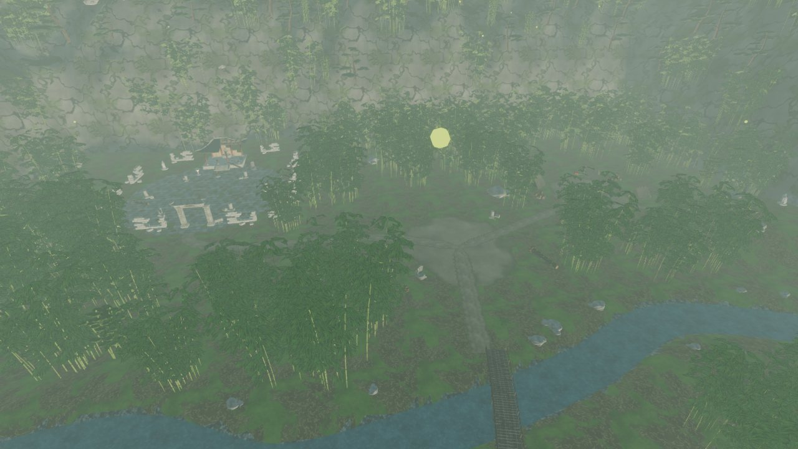 | 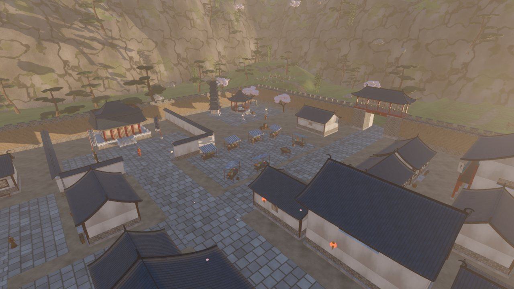 |
| **Blood Moon Abyss** | **Celestial Sky Isles** | **Meditation on the formation array** |
| 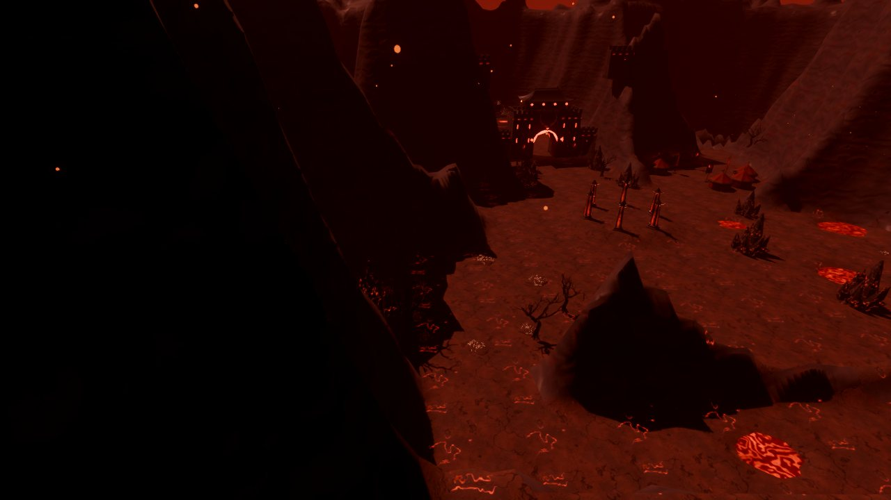 | 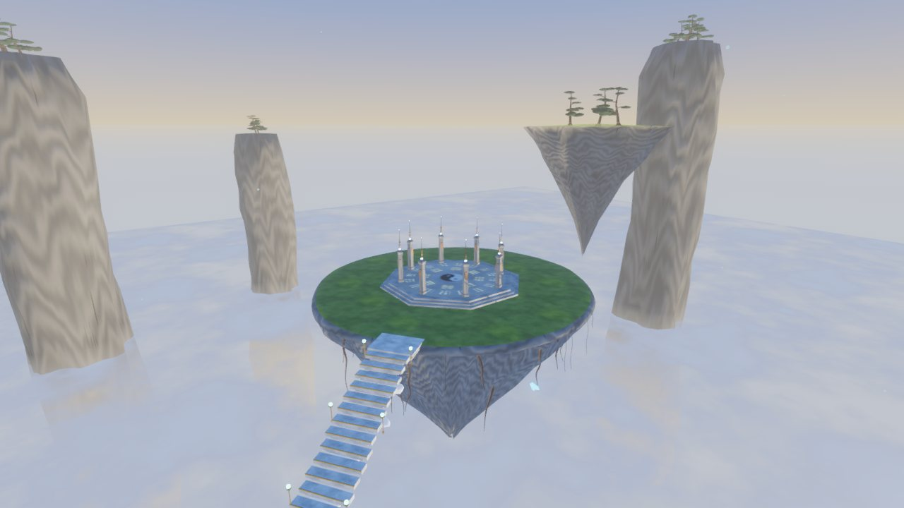 | 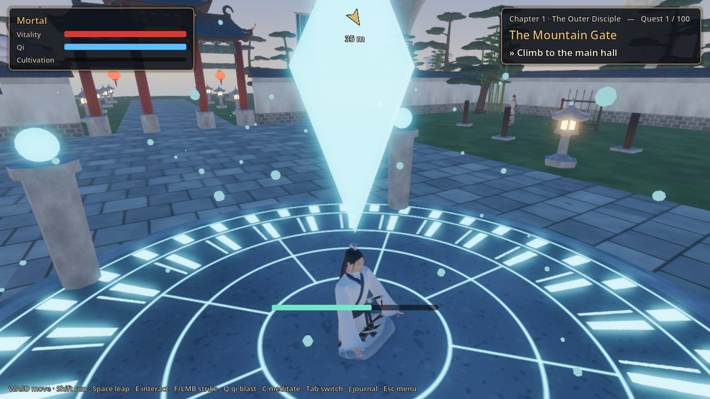 |

Each map is written by a Python layout module (`tools/maps/*.py`) with named markers from
`tools/world_spec.py`. The quests only ever refer to those markers, and CI checks that every marker stands on
walkable ground. Jade teleport arrays link the regions.

## Pipeline

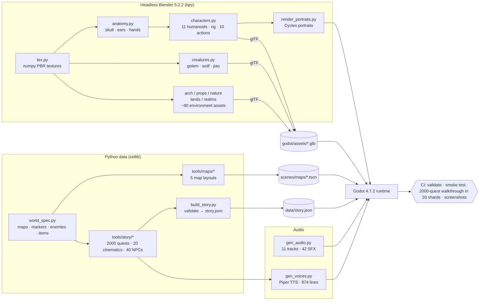
```mermaid
flowchart LR
    subgraph Blender["Headless Blender 5.2.2 (bpy)"]
        T[tex.py<br/>numpy PBR textures] --> AN[anatomy.py<br/>skull · ears · hands]
        AN --> CH[characters.py<br/>11 humanoids · rig · 10 actions]
        T --> CR[creatures.py<br/>golem · wolf · jiao]
        T --> EN[arch / props / nature<br/>lands / realms<br/>~80 environment assets]
        CH --> PR[render_portraits.py<br/>Cycles portraits]
    end
    subgraph Data["Python data (stdlib)"]
        WS[world_spec.py<br/>maps · markers · enemies · items] --> MAPS[tools/maps/*<br/>5 map layouts]
        WS --> ST[tools/story/*<br/>2000 quests · 20 cinematics · 40 NPCs]
        ST --> BS[build_story.py<br/>validate → story.json]
    end
    subgraph Audio["Audio"]
        GA[gen_audio.py<br/>11 tracks · 42 SFX] 
        GV[gen_voices.py<br/>Piper TTS · 974 lines]
    end
    CH & CR & EN -->|glTF| G[(godot/assets/*.glb)]
    MAPS --> SC[(scenes/maps/*.tscn)]
    BS --> SJ[(data/story.json)]
    ST --> GV
    G & SC & SJ & PR & GA & GV --> RT[Godot 4.7.2 runtime]
    RT --> CI{{CI: validate · smoke test ·<br/>2000-quest walkthrough in 20 shards · screenshots}}
```

## Game runtime

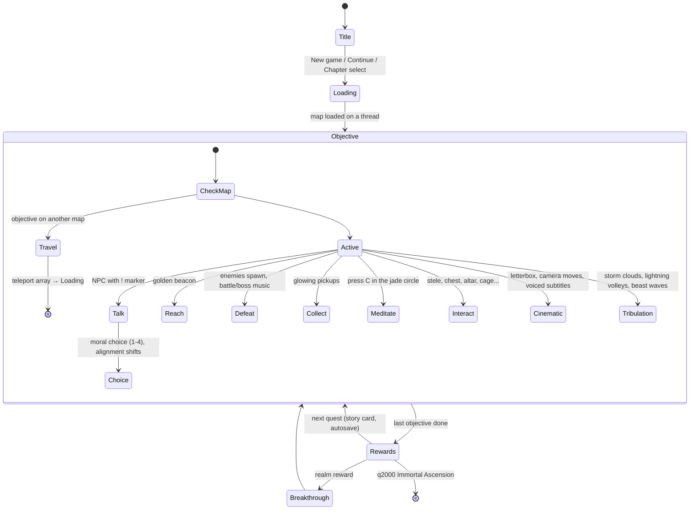
```mermaid
stateDiagram-v2
    [*] --> Title
    Title --> Loading: New game / Continue / Chapter select
    Loading --> Objective: map loaded on a thread
    state Objective {
        [*] --> CheckMap
        CheckMap --> Travel: objective on another map
        Travel --> [*]: teleport array → Loading
        CheckMap --> Active
        Active --> Talk: NPC with ! marker
        Active --> Reach: golden beacon
        Active --> Defeat: enemies spawn, battle/boss music
        Active --> Collect: glowing pickups
        Active --> Meditate: press C in the jade circle
        Active --> Interact: stele, chest, altar, cage...
        Active --> Cinematic: letterbox, camera moves, voiced subtitles
        Active --> Tribulation: storm clouds, lightning volleys, beast waves
        Talk --> Choice: moral choice (1-4), alignment shifts
    }
    Objective --> Rewards: last objective done
    Rewards --> Objective: next quest (story card, autosave)
    Rewards --> Breakthrough: realm reward
    Breakthrough --> Objective
    Rewards --> [*]: q2000 Immortal Ascension
```

| Script | Role |
|---|---|
| `autoload/story.gd` | loads `story.json` and `world.json`, fills `{player}`/`{junior}`… tokens, picks `_m`/`_f` voice takes |
| `autoload/game_state.gd` | quest/objective progress, cultivation realm and minor stage, alignment, choices and flags, stats, inventory, save/load (`user://save.json`) |
| `autoload/audio.gd` | music cross-fades, SFX pool, voice channel |
| `game.gd` | threaded map loading behind the loading screen, NPC population by story progress, travel, respawn |
| `quest_runner.gd` | runs each objective type, spawns what it needs, offers moral choices, grants rewards and breakthroughs |
| `world/tribulation.gd` | heavenly tribulations: swirling storm clouds, telegraphed lightning volleys, beast and heart-shade waves |
| `player.gd` · `world/enemy.gd` | third-person controller with palm strikes, qi blasts and meditation; data-driven enemy AI |
| `ui/*` | HUD, voiced dialogue with portraits, cinematics, loading screen, journal/pause, travel menu |

## Play it

Install [Godot 4.7](https://godotengine.org/download), then from the repository root:

```bash
godot --headless --path godot --import   # first run only: builds the .godot/ import cache
godot --path godot                       # title screen → New Game
```

| Input | Action |
|---|---|
| `WASD` / arrows | move (relative to camera) · `Shift` run (hold to sprint) · `Space` leap, again in the air to somersault, hold to glide; jump into a ledge to grab it |
| `Ctrl` (hold) · `B` | crouch (slide when sprinting) · sneak toggle |
| `E` | talk, interact, use a teleport array |
| `F` / left click (mouse captured) | palm combo (5 blows; crouched: uppercut) |
| `Z` · `X` | kick combo (airborne: flying kick) · jian sword combo |
| `H` / middle mouse (hold) | charge a heavy strike, release to unleash |
| `R` (hold) · `Alt` | block (tap just before a hit to parry) · dodge / roll / backflip |
| `Q` · `1`–`4` | qi blast (costs qi) · qi techniques: blast, twin-palm blast, shock wave, sword rain |
| `V` | gesture & emote menu (bows, feelings, daily life, cultivation, dance) |
| `C` | meditate: heals, restores qi, completes cultivation objectives |
| `G` | salute · `Tab` switch between Lin Feng and Su Yue |
| `J` / `Esc` | journal (current quest, Story So Far, chronicle, cultivation, settings, save) |
| right mouse drag, or click to capture | orbit camera · wheel to zoom |

## Rebuild everything

```bash
python3.13 -m venv .venv && . .venv/bin/activate
pip install bpy==5.2.2 numpy scipy soundfile piper-tts
python blender/build_assets.py                    # every character, creature and environment GLB
python blender/build_assets.py --only bandit,spirit_wolf
python blender/render_portraits.py                # dialogue portraits -> godot/ui/portraits
python tools/world_spec.py                        # godot/data/world.json
python tools/build_maps.py                        # godot/scenes/maps/*.tscn
python tools/build_story.py                       # validate + compile godot/data/story.json
python tools/gen_voices.py                        # Piper voices (models from rhasspy/piper v0.0.2 in ~/voices)
python tools/gen_audio.py                         # music + SFX
python tools/validate_glb.py godot/assets
godot --path godot --rendering-driver vulkan -s res://tests/capture_loading_art.gd   # loading-screen art
```

## Test headlessly

```bash
godot --headless --path godot --import
godot --headless --path godot -s res://tests/smoke_test.gd         # assets, rigs, maps, voices, a play session
godot --headless --path godot -s res://tests/walkthrough_test.gd   # plays all 2000 quests end to end
godot --headless --path godot -s res://tests/walkthrough_test.gd -- 101 200   # one volume (CI runs 10 shards)
godot --headless --path godot -s res://tests/animations_test.gd    # 100+ hero animations play, combos, emotes
xvfb-run -a godot --path godot --rendering-driver vulkan \
  -s res://tests/capture_screenshots.gd -- /tmp/shots              # needs a GPU or lavapipe
```

The walkthrough drives the real systems. It travels by teleport array, walks up to NPCs and presses interact,
palm-strikes every enemy, collects each pickup, meditates and plays every cinematic. It fails if any objective
cannot be completed, any marker floats, or the final realm is not *Immortal Ascension*.

## Layout

```
blender/
  build_assets.py        builds every GLB          render_portraits.py   dialogue portraits
  xianxia/
    anatomy.py           skull, face, ears, neck, hands + finger rig
    characters.py        humanoids: variants, hair styles, outfits, rig, weights, 10 actions
    creatures.py         stone golem, spirit wolf, Jiao serpent
    tex.py util.py       procedural textures, materials, mesh helpers
    arch.py props.py nature.py lands.py realms.py   buildings, props, terrain for all maps
godot/
  scenes/                title.tscn, game.tscn, player.tscn, maps/*.tscn (generated)
  scripts/               autoload/, ui/, world/, game.gd, quest_runner.gd, player.gd, map.gd
  data/                  story.json, world.json (generated)
  audio/                 music/, sfx/, voice/ (generated)
  ui/                    portraits/, loading/
  tests/                 smoke_test, walkthrough_test, capture_screenshots, capture_loading_art, capture_map
tools/
  world_spec.py          single source of truth for maps, markers, enemies, items, realms
  maps/                  map layout modules        story/   the 2000-quest saga as Python data
  build_maps.py build_story.py gen_voices.py gen_audio.py validate_glb.py
docs/                    STORY.md, AUDIO.md, screenshots/
```
