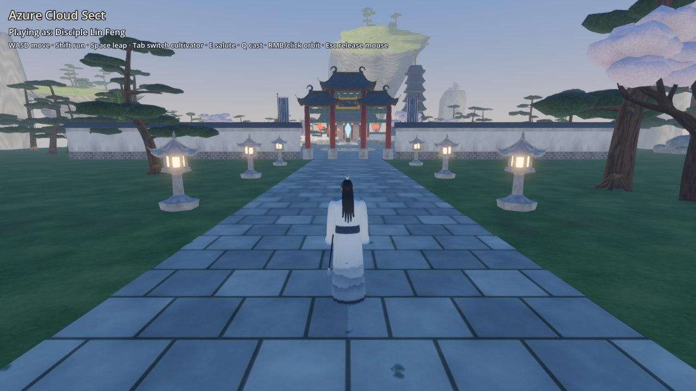
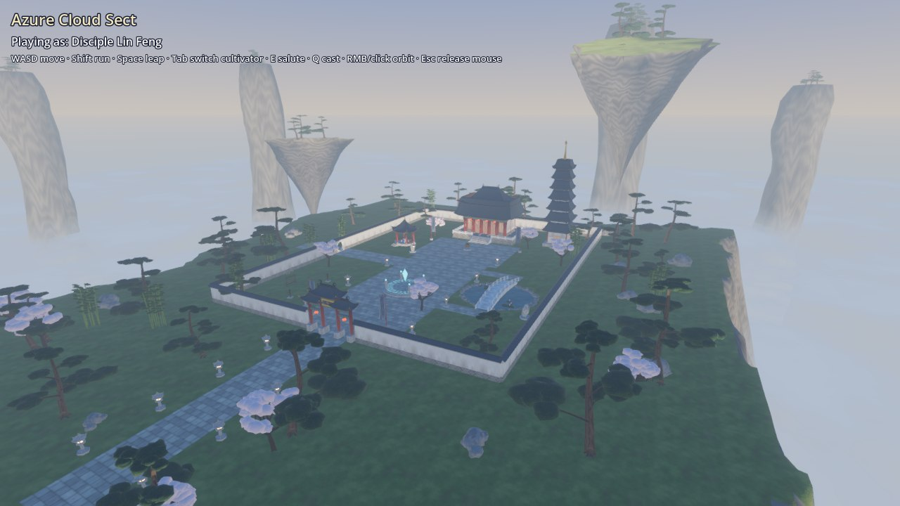
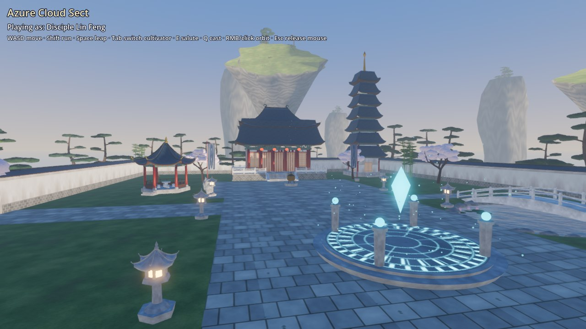
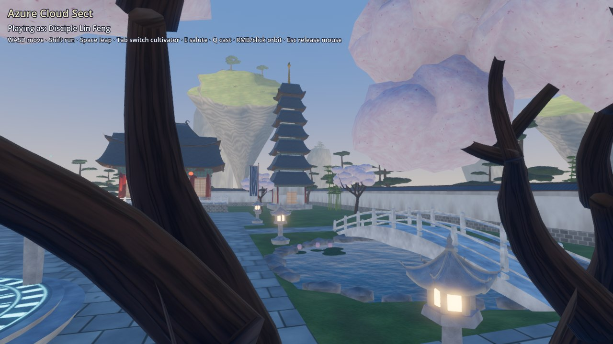
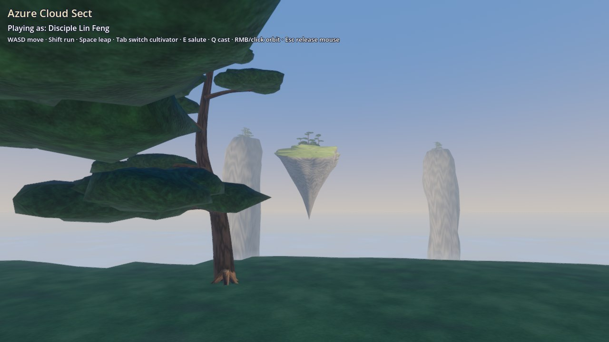
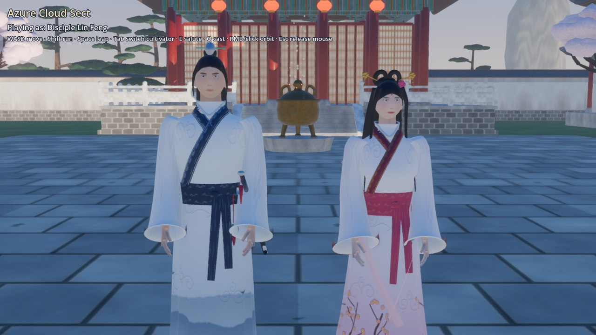
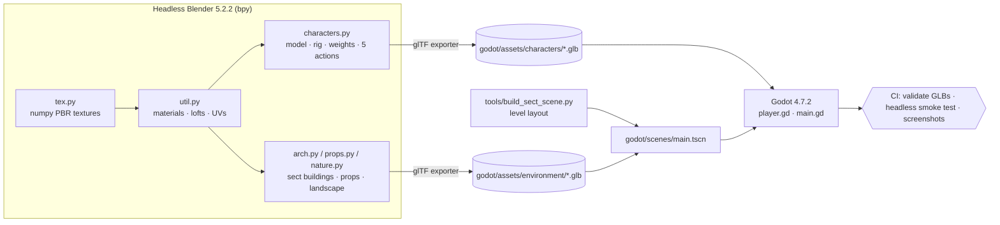

# vnxianxia — Azure Cloud Sect

Procedurally generated **xianxia** characters and a mountain-top sect, modelled,
textured, rigged and animated entirely by Python scripts running in **headless
Blender 5.2.2 LTS**, exported as `.glb`, and playable in **Godot 4.7.2**.



| Sect overview | Courtyard & formation array |
|---|---|
|  |  |
| **Pond, bridge & pagoda** | **Cliff edge above the sea of clouds** |
|  |  |

**Characters** (Cycles turnaround from headless Blender, then the same GLBs in Godot):


| All five animations (idle · walk · run · salute · cast) | Close-up in engine |
|---|---|
|  |  |

## What is generated

| Asset | Details |
|---|---|
| `cultivator_male.glb` | Disciple in a white hanfu with an ink-wash mountain hem, cross collar with huiwen embroidery, pleated skirt, wide sleeves, sash & jade pendant, jian in a lacquered scabbard, topknot with silver crown and jade pin |
| `cultivator_female.glb` | Fairy in a plum-blossom gradient robe, crimson/gold trims, double-loop hair buns with gold buyao hairpins, forehead huadian, sheer *pibo* ribbon draped over the arms |
| Rig | 24-bone humanoid skeleton (hips, spine, chest, neck, head, shoulders, arms, hands, legs, feet, toes, 3 hair bones), procedural skin weights; meshes include five-fingered hands, eyeballs, eyelids and layered hair |
| Animations | `idle`, `walk`, `run` (loops), `salute` (zuoyi cupped-hand bow, two-bone IK), `cast` (sword-seal gesture + thrust) |
| Textures | Generated with numpy: silk weave, damask clouds, embroidery, skin with painted face, eyes, hair strands, lacquer, wood, stone, roof tiles, painted beams, cliffs… packed as PBR (albedo, metal/rough, normal) |
| Environment (25 GLBs) | main hall (double-eave hip roof, dougong brackets, lattice doors, terrace & balustrade), paifang sect gate, 7-tier pagoda, hexagonal pavilion, courtyard & moon-gate walls, stone/red lanterns, incense cauldron, banners, weapon rack, training dummy, glowing formation array, arched bridge, lotus, pines, plum trees, bamboo, rocks, cliff plateau terrain, floating islands, karst peaks, cloud sea |
| Collisions | Blender objects named `*-convcolonly` / `*-colonly` / `*-col` become Godot static bodies on import |

## Pipeline



## Play it

1. Install [Godot 4.7](https://godotengine.org/download) (standard build).
2. Open `godot/project.godot` and press **F5**.

| Input | Action |
|---|---|
| `WASD` / arrows | move (relative to camera) |
| `Shift` | run |
| `Space` | qinggong leap |
| `Tab` | switch between Lin Feng (male) and Su Yue (female) |
| `E` / `Q` | salute / cast |
| right mouse drag, or click to capture | orbit camera · wheel to zoom · `Esc` releases the mouse |

## Rebuild the assets

Blender is used as a Python module, so no GUI or display is needed:

```bash
python3.13 -m venv .venv && . .venv/bin/activate
pip install bpy==5.2.2                        # Blender 5.2.2 LTS, headless
python blender/build_assets.py                # all 27 GLBs -> godot/assets (~1 min)
python blender/build_assets.py --only pagoda,cultivator_female
python tools/build_sect_scene.py              # regenerate godot/scenes/main.tscn
python tools/validate_glb.py godot/assets     # structural checks
python blender/render_previews.py             # Cycles turnaround -> docs/screenshots
```

A regular Blender binary works too:
`blender --background --factory-startup --python blender/build_assets.py -- --only pagoda`.

## Test headlessly

```bash
godot --headless --path godot --import
godot --headless --path godot -s res://tests/smoke_test.gd      # exits 1 on failure
xvfb-run -a godot --path godot --rendering-driver vulkan \
  -s res://tests/capture_screenshots.gd -- /tmp/shots           # needs a GPU or lavapipe
```

The smoke test loads every GLB, checks each character has one 24-bone skeleton
and all five animations, then plays the level: the player must land on the
ground, walk, run 8 m toward the gate, swap character and salute.

## Layout

```
blender/
  build_assets.py        entry point: builds every GLB
  render_previews.py     Cycles character turnaround
  xianxia/
    tex.py               procedural numpy textures
    util.py              materials, mesh lofting, UVs, glTF export
    characters.py        cultivators: modelling, rig, weights, animation
    arch.py              roofs, columns, brackets, hall, gate, pagoda, pavilion, walls
    props.py             lanterns, cauldron, banner, bridge, formation array...
    nature.py            trees, rocks, plateau terrain, floating islands, cloud sea
    catalog.py           asset name -> builder
godot/
  project.godot          Godot 4.7, Forward+
  assets/                generated GLBs (committed so the project opens ready to play)
  scenes/                main.tscn (generated layout), player.tscn
  scripts/               player.gd (third-person controller), main.gd (HUD, VFX)
  tests/                 smoke_test.gd, capture_screenshots.gd
tools/                   build_sect_scene.py, validate_glb.py
.github/workflows/ci.yml lint · Blender build · Godot smoke test · screenshots
```
