# vnxianxia — Azure Cloud Sect: *The Lotus and the Blood Moon*

A third-person **xianxia action-RPG** with a **2000-quest main story**, built entirely from code.
Headless **Blender 5.2.2** Python scripts model, texture, rig and animate every character, creature, building,
prop and HUD ornament. Five generated maps (each about ten times the area of the first release, with 124
generated buildings and landmarks), a voiced story told in group conversations with cinematics, and a full game
runtime (quests, dialogue, combat, HUD, loading screens, journal) run in **Godot 4.7.2**. The music and sound
effects are synthesised with numpy, and all 1170 voice files are neural TTS (Piper).

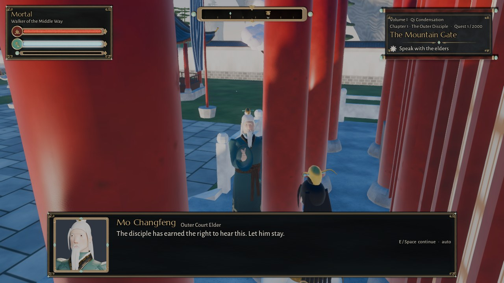

| Chapter intro cinematic | Quest HUD: tracker, compass, objective marker |
|---|---|
|  |  |
| **Spirit wolves in the bamboo forest** | **Boss: Jiao, the Flood Dragon** |
|  |  |
| **Title screen** | **Loading screen with the chapter synopsis** |
|  |  |

## The story

*Three hundred years ago the Blood Moon Patriarch drowned three kingdoms in blood trying to seize the heavens.
The Azure Cloud and Verdant Lotus sects sealed him beneath the Abyss, and the world forgot the Verdant Lotus.
Now an orphan climbs nine thousand steps to the Azure Cloud with nothing but a mother's jade pendant. The seal is
weakening, and someone inside the sect is helping the Blood Moon.*

The saga has 2000 main quests: 10 volumes, one per major stage of cultivation from Qi Condensation to Tribulation
Transcendence, each of 10 chapters of 20 quests, one chapter per minor stage (1st Layer to Great Perfection), from
Mortal to Immortal Ascension. Every major breakthrough calls down a heavenly tribulation to survive, and all but one
quest (the finale's climactic tribulation fight, which has no room for one) offers a moral choice that moves the hero
along two axes, Bearing (disciplined/precept-bound &lt;-&gt; free-wandering) and the Dao (righteous &lt;-&gt; demonic),
giving nine cultivation temperaments from Guardian of the Precepts to Servant of the Blood Moon; elders, juniors,
townsfolk and demonic cultivators react to the alignment and realm the hero reaches. It has 20 cinematics, 66
named NPCs (40 principal characters and 26 minor locals of the new districts) and 958 voiced lines (plus male and
female takes of every line that names the hero) in the ten original chapters, and about 230,000 more words of
text-only dialogue in the 90 chapters built around them. Every quest has at least one conversation between the hero
and two or more NPCs, who gather around the speaker in the world. Play as
**Lin Feng** or **Su Yue**; Tab switches between
them and the dialogue follows. The full plot, the cast and the volume and chapter lists are in
**[docs/STORY.md](docs/STORY.md)**; every quest is listed in **[docs/QUESTS.md](docs/QUESTS.md)**. In game, the
journal's *Story So Far* page recaps every volume and chapter you have reached.


```mermaid
flowchart LR
    V1["I · Qi Condensation<br/>The Mountain and the Pendant<br/>sect · bandits · first secret realm"] --> V2["II · Foundation Establishment<br/>The Traitor in the Law Hall<br/>ruins · tournament · beast tide"]
    V2 --> V3["III · Core Formation<br/>Blood Beneath the Earth<br/>Abyss · siege · Nine Banners"]
    V3 --> V4["IV · Nascent Soul<br/>Isles Above the Clouds<br/>Sky Isles · soul techniques"]
    V4 --> V5["V · Soul Transformation<br/>The Heart Demon<br/>Elder Mo's sacrifice · the fold"]
    V5 --> V6["VI · Spirit Severing<br/>The Fold in the World<br/>rifts · Rungs of the Ladder"]
    V6 --> V7["VII · Void Refinement<br/>A Body Worth Stealing<br/>Brother Hollow · the Butcher"]
    V7 --> V8["VIII · Body Integration<br/>The Great Vehicle<br/>conclave of forty sects · Lady Silk"]
    V8 --> V9["IX · Mahayana<br/>Heaven Takes Notice<br/>lesser tribulation · the Seventh Rung"]
    V9 --> V10["X · Tribulation Transcendence<br/>The Last Blood Moon<br/>Patriarch · the Stair · Immortal Ascension"]
```

## Characters

Every character is modelled, textured, rigged and animated by about 12,500 lines of Blender Python
(`blender/xianxia/face_*.py`, `hair_*.py`, `skin*.py`, `gait.py`, `anatomy.py`, `characters.py`, `moves.py`, `tex.py`):

- **Faces** (`face_*.py`, 14 modules): a head built from about 150 anatomical landmarks placed by measured
  proportions of young Korean adult faces (facial thirds and fifths, a soft V-line jaw, midface projection, a parallel
  or in-out double eyelid, aegyo-sal, a 7° canthal tilt), with aged variants for the elders. It is a quad grid with
  edge loops around the eyes, mouth and nostrils, eyeballs with a refracting cornea, sealed eyelids that follow the
  gaze (`eye.L`/`eye.R` bones), a caruncle and tear line, teeth, gums and tongue, and lash and brow cards. Geometric
  self-checks run on every build (lid seal, blink closure, symmetry, folds).
- **Facial animation**: 22 shape keys (blinks, visemes, smile, frown, brows, squint, jaw...) baked into every
  action: randomised blinks and eye saccades in idle, speech mouth shapes and nods in `talk`, a smile in `salute`, a
  wince in `hit`, closed eyes in `meditate` and `death`. They reach Godot as blend-shape tracks (the smoke test
  checks every face).
- **Hair** (`hair_*.py`): strand cards grown from guide curves on the actual scalp, combed along flow fields,
  settled by a follow-the-leader solver with gravity and collision, clumped, and textured by a procedural strand
  atlas (root-to-tip colour, per-strand jitter, flow and depth maps). Nine styles, from the hero's topknot with a guan
  to the heroine's half-up hair with see-through bangs and hairpins, plus beards.
- **Skin** (`skin*.py`): a melanin/haemoglobin colour model painted in UV space from the head's landmarks: pores
  along skin tension lines, fine lines, vellus, moles, blush and lip tint masked to the lip borders, beard shadow,
  wrinkles and age spots, an oily T-zone lobe, iris and sclera textures.
- **Walking and running** (`gait.py`): IK locomotion with feet locked to the ground through each stance
  (verified to under 1 mm of slip), heel strike to toe-off roll, a flight phase when running, pelvic rotation and
  tilt, chest counter-rotation, a steady head and lagging arms, authored at exactly the game's speeds (walk 1.6, run
  4.6, sprint 6.2 m/s) so the runtime scales playback by ground speed. Wide sleeves hang from their own pendulum
  bones.

| Faces before and after (Cycles portraits) |
|---|
| 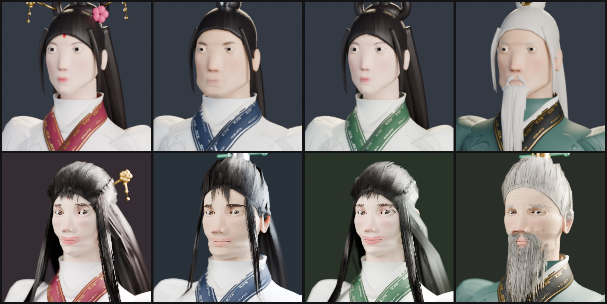 |

| Hair and skin | Walk and run cycles (dressed and skeleton) |
|---|---|
| 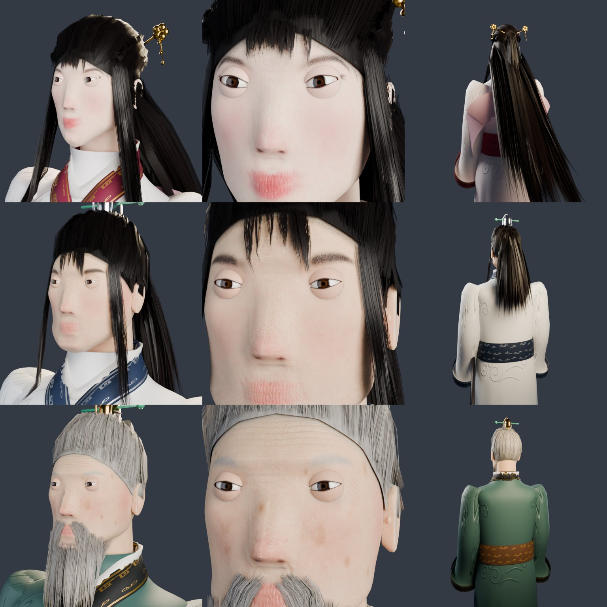 | 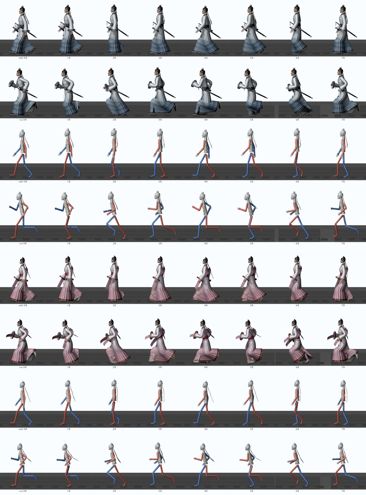 |


| Model | Used for |
|---|---|
| `cultivator_male` / `cultivator_female` | the heroes Lin Feng and Su Yue (the heart demon is a shadow clone) |
| `elder_male`, `sect_master`, `disciple_male/female`, `villager_male/female` | 26 NPCs, re-tinted per character |
| `bandit`, `demon_cultivator`, `blood_patriarch` | enemies and the final boss (glowing irises, horns) |
| `stone_golem` | training puppets, stone sentinels, the Lotus Guardian (humanoid rig of rock chunks) |
| `spirit_wolf` | spirit, corrupted and king wolves (quadruped rig) |
| `jiao_serpent` | the flood dragon boss (spine-chain rig) |

Humanoids have 10 animations: `idle walk run salute cast attack hit death meditate talk`. Creatures have
`idle walk run attack hit death`. Finger poses (fist, sword seal, mudra, open palm) are animated too.

The two heroes carry **136 animations** (the 10 above plus 126 from `blender/xianxia/moves.py`): locomotion
extras (walk back, strafes, run start/stop, turns, qinggong sprint, crouch, sneak, jump start/air/fall/land,
hard landing, somersault, glide, slide, ledge hang, climb), palm / kick / jian-sword combos, spin and flying
kicks, a charged strike, four qi techniques, block / parry / dodges / roll / backflip, directional staggers,
knockdown and get-up, two deaths and a revival, meditation variants, breakthrough, hand seals, flying-sword
riding, 50+ social and daily-life emotes, a four-part dance, victory poses, idle fidgets and talk gestures.
Each is authored as a few key poses of readable controls (IK hand and foot targets, torso angles, finger
presets) and solved per frame with two-bone IK so planted feet stay planted, with monotone spline easing,
overlapping-action offsets and seamless loops; the GLBs are then keyframe-reduced (about 12.5-13.5 MB each with
the facial morph targets). The rig has 58 bones: 54 body and finger bones, two sleeve drapes and two eyes.


## Maps

| Azure Cloud Sect | Whispering Bamboo Forest | Qingshi Town |
|---|---|---|
|  |  |  |
| **Blood Moon Abyss** | **Celestial Sky Isles** | **Meditation on the formation array** |
|  |  |  |

Each map is about ten times the area of the first release, grown around its original core:

| Map | Size | New districts |
|---|---|---|
| Azure Cloud Sect | the whole massif, about 600 x 630 m | outer sect, mission hall, martial arena, bell and drum towers, treasure tower, Sword Peak by chain bridge, sword tomb, medicine valley and pill kilns, beast garden, waterfall cave, ancestral tombs, tea terraces |
| Whispering Bamboo Forest | about 560 x 570 m | stilt-house village, misty lake with pavilion and jetty, waterwheel, buried temple, carved buddha cliff, gorge with rope bridge, banyan giant, poison marsh |
| Qingshi Town | a walled county town, about 560 m across | night market, granary, silk workshop and dye yard, academy and exam cells, merchant manor, opera stage and temple fair, City God temple, canal, docks, mill, barracks |
| Blood Moon Abyss | about 590 x 500 m, ten times the walkable floor | blood river and bone bridge, slave mines, soul forge, ash plains, lava falls, obsidian spires, ruined sect, ghost village, demon palace |
| Celestial Sky Isles | 30 new isles, about 100,000 m² | immortal palace, hall of records, observatory, cloud harbour and sky-ship wreck, dragon bones, peach garden, gate of heaven, tree of ages |

| Sect overview | Sect mission district | Qingshi Town street |
|---|---|---|
| 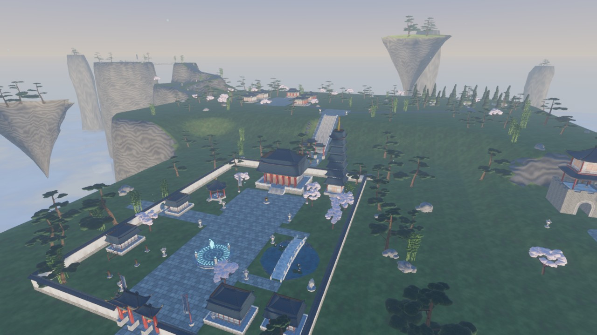 | 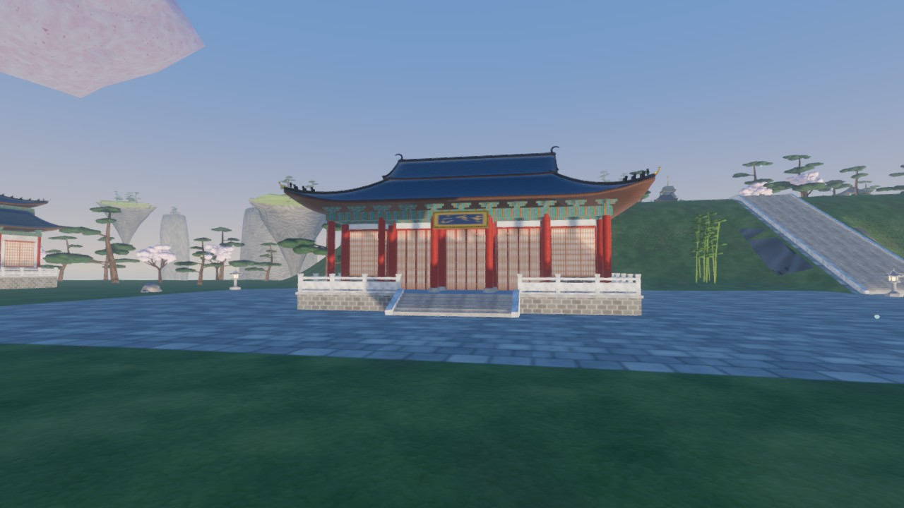 | 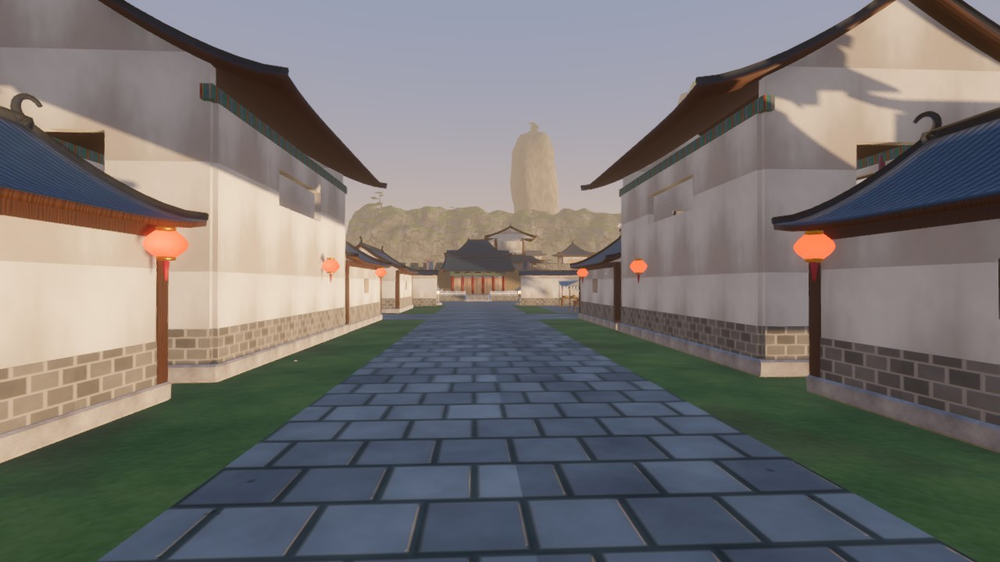 |
| **Bamboo village** | **Demon palace** | **Immortal palace** |
| 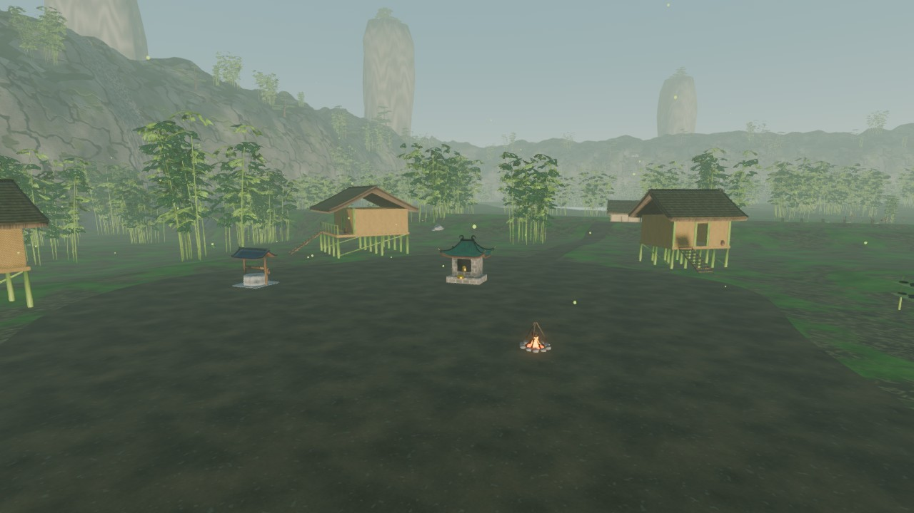 | 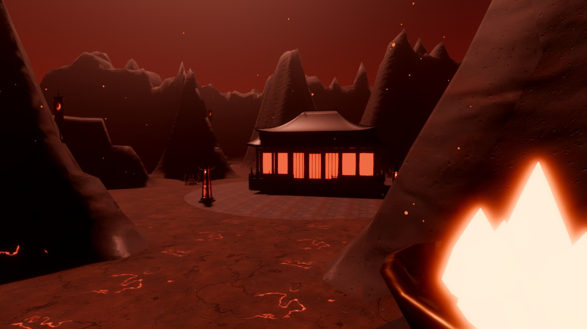 | 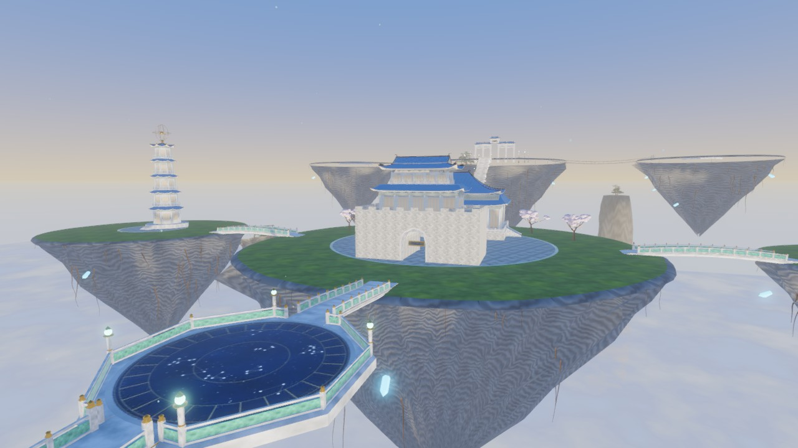 |

Each map is written by a Python layout module (`tools/maps/*.py`) with named markers from
`tools/world_spec.py` (287 markers, 152 of them new). The 124 new buildings and landmarks come from
`blender/xianxia/buildings*.py`: parametric halls with bracket sets, curved roofs and ridge beasts, towers, gates,
bridges, stilt houses, demonic and celestial architecture, all with collision and stairs of 0.17 m risers. The quests
only ever refer to markers; they now use 221 distinct places, every new one included, and no single spot hosts more
than 84 objectives. CI checks that every marker stands on walkable ground. Jade teleport arrays link the regions.

Quests also use 40 interactable props (30 new, from `blender/xianxia/quest_props.py`, such as the mission notice
board, pill furnace, tortoise stele, armillary sphere and sealed coffin) in 676 interact objectives, and all 18
collectibles have their own model (`blender/xianxia/items.py`).

| Quest props | Collectibles |
|---|---|
| 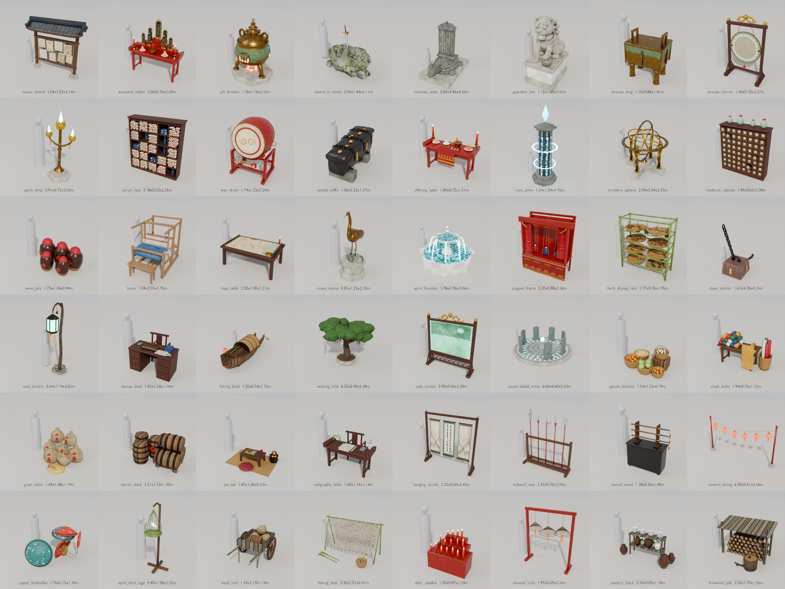 | 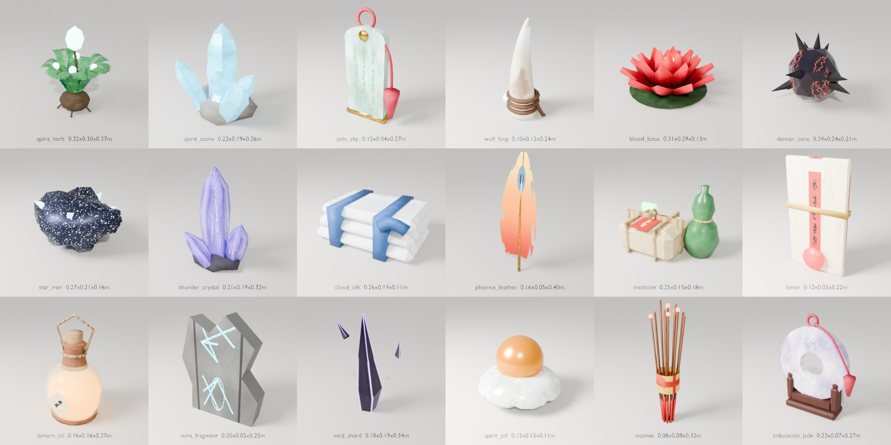 |

## Group conversations

A talk objective is a scene: the NPCs named in its `with` list gather on open ground around the speaker, the
conversation camera cuts over the shoulder to whoever speaks, listeners turn to the speaker, and the portrait and
name follow each line. Text appears at once; one key press advances one line.

```mermaid
sequenceDiagram
    participant P as Player
    participant QR as quest_runner.gd
    participant M as map.gd
    participant C as conversation.gd
    participant D as dialogue_ui.gd
    P->>QR: E near the NPC with the ! marker
    QR->>M: open_spot() + reachable() for each NPC in "with"
    M-->>QR: spots on open ground around the speaker
    QR->>C: begin(group, player)
    loop every line
        C->>C: speaker plays talk, listeners face them, camera cuts over the shoulder
        C->>D: line (portrait, name, text shown at once)
        P->>D: E / Space / click (one press = one line)
    end
    QR->>D: moral choice (1-4), a companion may react
    C-->>P: gameplay camera back; guests leave, locals walk home
```

| A three-way conversation | The reply after a choice |
|---|---|
|  | 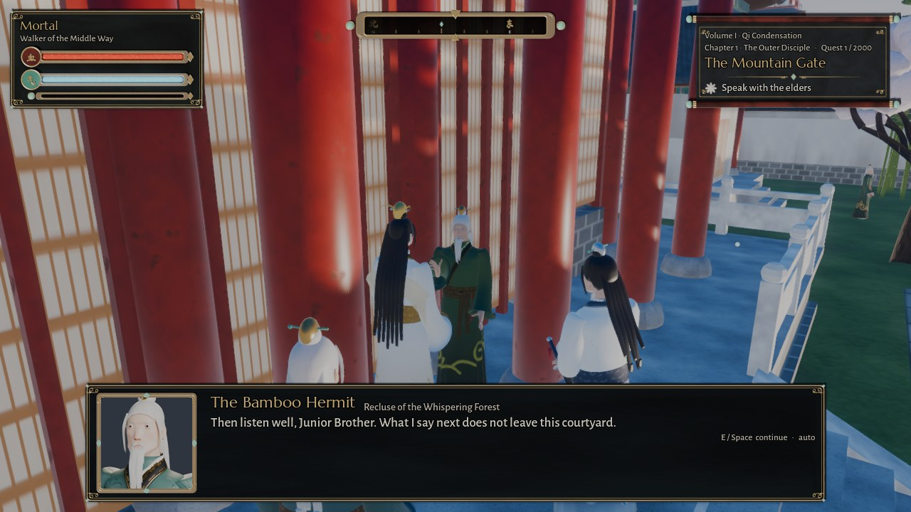 |

## HUD

The HUD kit is rendered by headless Blender (`blender/render_hud.py`): lacquered ink-jade panels with gilt
cloud-scroll corners, carved jade gauges with 血 and 气 medallions, a scrolling 东南西北 compass strip, a quest
scroll, toast ribbons, keycap chips, a meditation ring and a portrait frame, all 9-sliced from 2x textures. The UI
scales with the window (`canvas_items` stretch on a 1280x720 base) and is pinned to the screen corners, so it holds
at 16:9, 16:10, 21:9 and 4:3.

| 1280x720 | 2560x1080 |
|---|---|
| 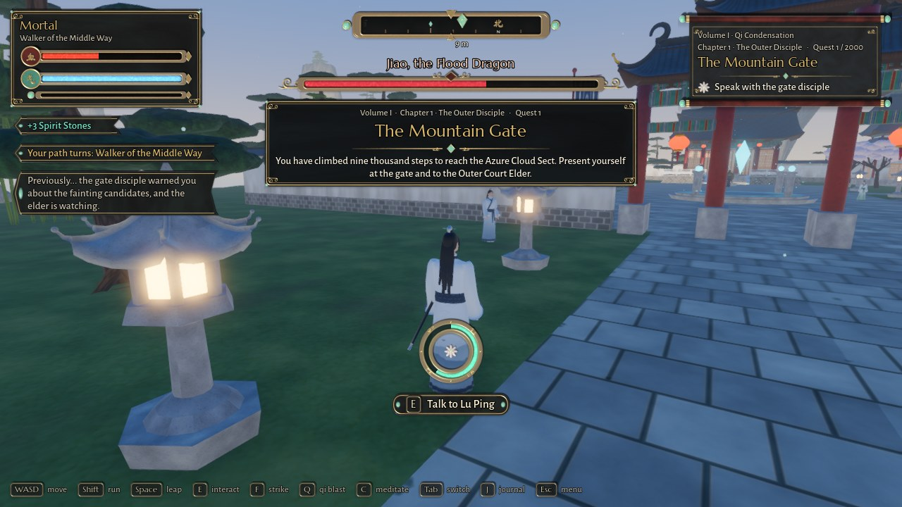 | 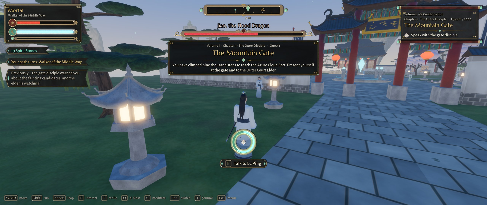 |

## Bug hunt

Every defect found and fixed in this round is logged, one line each (symptom -> cause -> fix with file:line), in
[docs/bugfixes/](docs/bugfixes/):

| Log | Fixed | Examples |
|---|---|---|
| [runtime](docs/bugfixes/runtime.md) | 77 | no step-up onto stairs; dialogue skip re-triggering the conversation; pickups spawned inside buildings; camera depth precision |
| [world](docs/bugfixes/world.md) | 65 | coplanar floors z-fighting ("flipping textures"); unclimbable plinth colliders; an orphaned duplicate pier |
| [props](docs/bugfixes/props.md) | 24 | 3,535 overlapping face pairs; props with no model; a boat with both rails on one side |
| [face](docs/bugfixes/face.md) | 32 | inside-out eyeballs; lids 2.3 mm off the eye; lip tint painted past the lips |
| [animation](docs/bugfixes/animation.md) | 20 | feet sliding 4-45 cm per step; NPCs running leaning back; morph targets lost in the keyframe pass |
| [story](docs/bugfixes/story.md) | 19 | lines by NPCs not present; "We're done at here." x130; a traitor revealed 200 quests early |
| [hair and skin](docs/bugfixes/hair_skin.md) | 11 | isotropic plastic hair highlight; box-mapped buns; NaN noise at small sizes |
| [HUD](docs/bugfixes/hud.md) | 10 | UI never scaled with resolution; banners drawn over quest cards |


## Pipeline

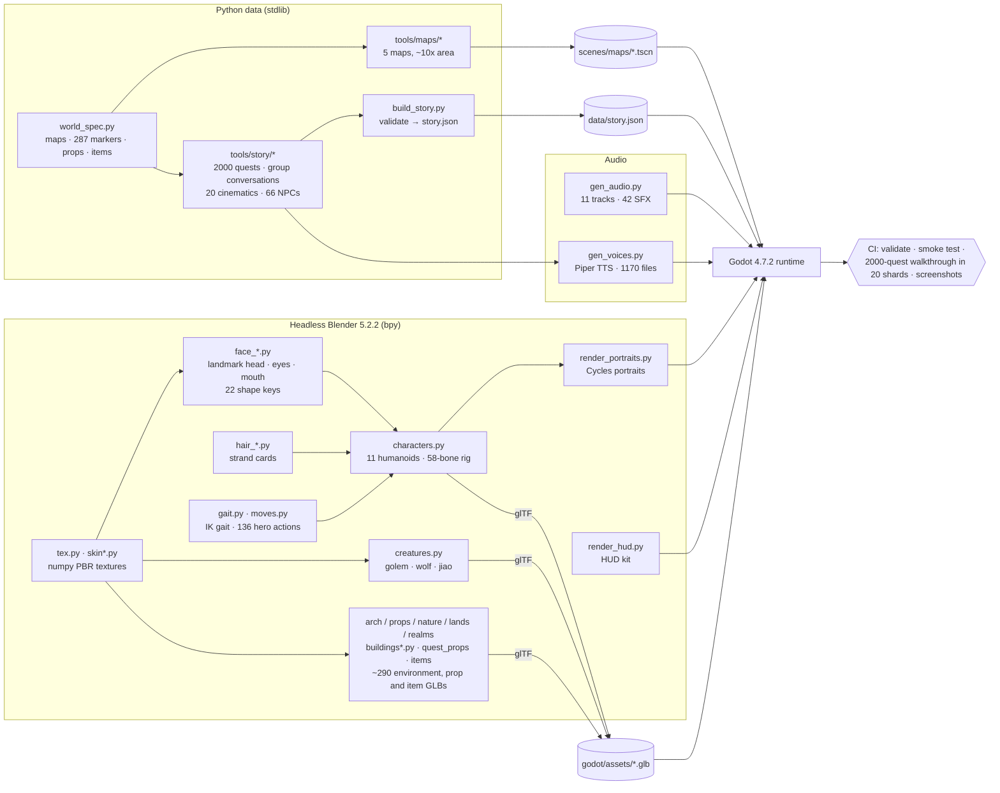
```mermaid
flowchart LR
    subgraph Blender["Headless Blender 5.2.2 (bpy)"]
        T[tex.py · skin*.py<br/>numpy PBR textures] --> FA[face_*.py<br/>landmark head · eyes · mouth<br/>22 shape keys]
        HA[hair_*.py<br/>strand cards] --> CH
        FA --> CH[characters.py<br/>11 humanoids · 58-bone rig]
        GT[gait.py · moves.py<br/>IK gait · 136 hero actions] --> CH
        T --> CR[creatures.py<br/>golem · wolf · jiao]
        T --> EN[arch / props / nature / lands / realms<br/>buildings*.py · quest_props · items<br/>~290 environment, prop and item GLBs]
        CH --> PR[render_portraits.py<br/>Cycles portraits]
        HUD[render_hud.py<br/>HUD kit]
    end
    subgraph Data["Python data (stdlib)"]
        WS[world_spec.py<br/>maps · 287 markers · props · items] --> MAPS[tools/maps/*<br/>5 maps, ~10x area]
        WS --> ST[tools/story/*<br/>2000 quests · group conversations<br/>20 cinematics · 66 NPCs]
        ST --> BS[build_story.py<br/>validate → story.json]
    end
    subgraph Audio["Audio"]
        GA[gen_audio.py<br/>11 tracks · 42 SFX] 
        GV[gen_voices.py<br/>Piper TTS · 1170 files]
    end
    CH & CR & EN -->|glTF| G[(godot/assets/*.glb)]
    MAPS --> SC[(scenes/maps/*.tscn)]
    BS --> SJ[(data/story.json)]
    ST --> GV
    G & SC & SJ & PR & HUD & GA & GV --> RT[Godot 4.7.2 runtime]
    RT --> CI{{CI: validate · smoke test ·<br/>2000-quest walkthrough in 20 shards · screenshots}}
```

## Game runtime

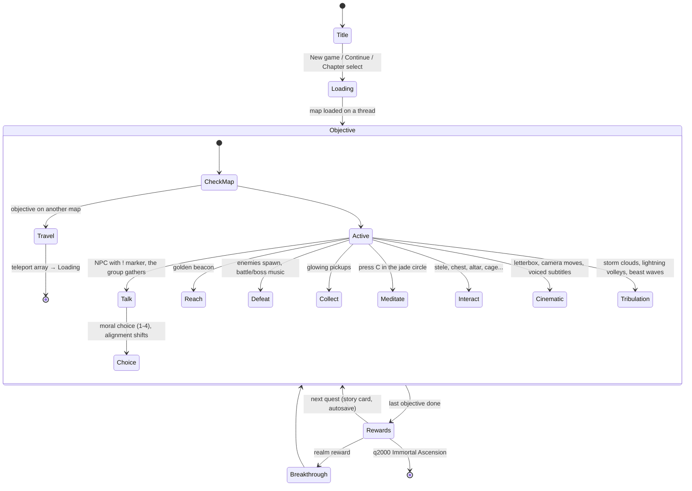
```mermaid
stateDiagram-v2
    [*] --> Title
    Title --> Loading: New game / Continue / Chapter select
    Loading --> Objective: map loaded on a thread
    state Objective {
        [*] --> CheckMap
        CheckMap --> Travel: objective on another map
        Travel --> [*]: teleport array → Loading
        CheckMap --> Active
        Active --> Talk: NPC with ! marker, the group gathers
        Active --> Reach: golden beacon
        Active --> Defeat: enemies spawn, battle/boss music
        Active --> Collect: glowing pickups
        Active --> Meditate: press C in the jade circle
        Active --> Interact: stele, chest, altar, cage...
        Active --> Cinematic: letterbox, camera moves, voiced subtitles
        Active --> Tribulation: storm clouds, lightning volleys, beast waves
        Talk --> Choice: moral choice (1-4), alignment shifts
    }
    Objective --> Rewards: last objective done
    Rewards --> Objective: next quest (story card, autosave)
    Rewards --> Breakthrough: realm reward
    Breakthrough --> Objective
    Rewards --> [*]: q2000 Immortal Ascension
```

| Script | Role |
|---|---|
| `autoload/story.gd` | loads `story.json` and `world.json`, fills `{player}`/`{junior}`… tokens, picks `_m`/`_f` voice takes |
| `autoload/game_state.gd` | quest/objective progress, cultivation realm and minor stage, alignment, choices and flags, stats, inventory, save/load (`user://save.json`) |
| `autoload/audio.gd` | music cross-fades, SFX pool, voice channel |
| `game.gd` | threaded map loading behind the loading screen, NPC population by story progress, travel, respawn |
| `quest_runner.gd` | runs each objective type, spawns what it needs, offers moral choices, grants rewards and breakthroughs |
| `world/tribulation.gd` | heavenly tribulations: swirling storm clouds, telegraphed lightning volleys, beast and heart-shade waves |
| `player.gd` · `world/enemy.gd` | third-person controller with palm strikes, qi blasts and meditation; data-driven enemy AI |
| `world/stepper.gd` | step-up onto risers up to 0.45 m and step-down snapping, for the player and enemies |
| `world/conversation.gd` | group conversations: staging around the speaker, over-the-shoulder shots per line, facing |
| `ui/*` | Blender-rendered HUD, instant-text dialogue with framed portraits, cinematics, loading screen, journal/pause, travel menu |

## Play it

Install [Godot 4.7](https://godotengine.org/download), then from the repository root:

```bash
godot --headless --path godot --import   # first run only: builds the .godot/ import cache
godot --path godot                       # title screen → New Game
```

| Input | Action |
|---|---|
| `WASD` / arrows | move (relative to camera) · `Shift` run (hold to sprint) · `Space` leap, again in the air to somersault, hold to glide; jump into a ledge to grab it |
| `Ctrl` (hold) · `B` | crouch (slide when sprinting) · sneak toggle |
| `E` | talk, interact, use a teleport array |
| `F` / left click (mouse captured) | palm combo (5 blows; crouched: uppercut) |
| `Z` · `X` | kick combo (airborne: flying kick) · jian sword combo |
| `H` / middle mouse (hold) | charge a heavy strike, release to unleash |
| `R` (hold) · `Alt` | block (tap just before a hit to parry) · dodge / roll / backflip |
| `Q` · `1`–`4` | qi blast (costs qi) · qi techniques: blast, twin-palm blast, shock wave, sword rain |
| `V` | gesture & emote menu (bows, feelings, daily life, cultivation, dance) |
| `C` | meditate: heals, restores qi, completes cultivation objectives |
| `G` | salute · `Tab` switch between Lin Feng and Su Yue |
| `J` / `Esc` | journal (current quest, Story So Far, chronicle, cultivation, settings, save) |
| right mouse drag, or click to capture | orbit camera · wheel to zoom |

## Rebuild everything

```bash
python3.13 -m venv .venv && . .venv/bin/activate
pip install bpy==5.2.2 numpy scipy soundfile piper-tts
python blender/build_assets.py                    # every character, creature and environment GLB
python blender/build_assets.py --only bandit,spirit_wolf
python blender/render_portraits.py                # dialogue portraits -> godot/ui/portraits
python tools/world_spec.py                        # godot/data/world.json
python tools/build_maps.py                        # godot/scenes/maps/*.tscn
python tools/build_story.py                       # validate + compile godot/data/story.json
python tools/gen_voices.py                        # Piper voices (models from rhasspy/piper v0.0.2 in ~/voices)
python tools/gen_audio.py                         # music + SFX
python tools/validate_glb.py godot/assets
godot --path godot --rendering-driver vulkan -s res://tests/capture_loading_art.gd   # loading-screen art
```

## Test headlessly

```bash
godot --headless --path godot --import
godot --headless --path godot -s res://tests/smoke_test.gd         # assets, rigs, maps, voices, a play session
godot --headless --path godot -s res://tests/walkthrough_test.gd   # plays all 2000 quests end to end
godot --headless --path godot -s res://tests/walkthrough_test.gd -- 101 200   # one volume (CI runs 10 shards)
godot --headless --path godot -s res://tests/animations_test.gd    # 100+ hero animations play, combos, emotes
xvfb-run -a godot --path godot --rendering-driver vulkan \
  -s res://tests/capture_screenshots.gd -- /tmp/shots              # needs a GPU or lavapipe
```

The walkthrough drives the real systems. It travels by teleport array, walks up to NPCs and presses interact,
palm-strikes every enemy, collects each pickup, meditates and plays every cinematic. It fails if any objective
cannot be completed, any marker floats, or the final realm is not *Immortal Ascension*.

## Layout

```
blender/
  build_assets.py        builds every GLB          render_portraits.py   dialogue portraits
  render_hud.py          the HUD kit               render_props_sheet.py, render_animation_sheet.py   contact sheets
  xianxia/
    face_*.py            landmark head, eyes, mouth, lash/brow cards, shape keys, facial animation, self-checks
    hair_*.py skin*.py   strand-card groom and atlas; layered skin, eye and mouth textures and shaders
    gait.py moves.py     IK walk/run/sprint and sleeve drapes; the 136 hero actions
    anatomy.py           ears, hands + finger rig
    characters.py        humanoids: variants, outfits, rig, weights, base actions
    creatures.py         stone golem, spirit wolf, Jiao serpent
    tex.py util.py       procedural textures, materials, mesh helpers
    arch.py props.py nature.py lands.py realms.py   buildings, props, terrain for all maps
    buildings*.py        the 124 buildings and landmarks of the enlarged maps
    quest_props.py items.py   interactable quest props, dressing props, collectible models
godot/
  scenes/                title.tscn, game.tscn, player.tscn, maps/*.tscn (generated)
  scripts/               autoload/, ui/, world/, game.gd, quest_runner.gd, player.gd, map.gd
  data/                  story.json, world.json (generated)
  audio/                 music/, sfx/, voice/ (generated)
  ui/                    hud/, fonts/, portraits/, loading/
  tests/                 smoke_test, walkthrough_test, capture_screenshots, capture_loading_art, capture_map
tools/
  world_spec.py          single source of truth for maps, markers, enemies, items, realms
  maps/                  map layout modules        story/   the 2000-quest saga as Python data
  build_maps.py build_story.py gen_voices.py gen_audio.py validate_glb.py zfight_glb.py
docs/                    STORY.md, AUDIO.md, QUESTS.md, bugfixes/ (defect logs), screenshots/
AGENTS.md                in every directory: what it holds, what generates it, how to test it
```
